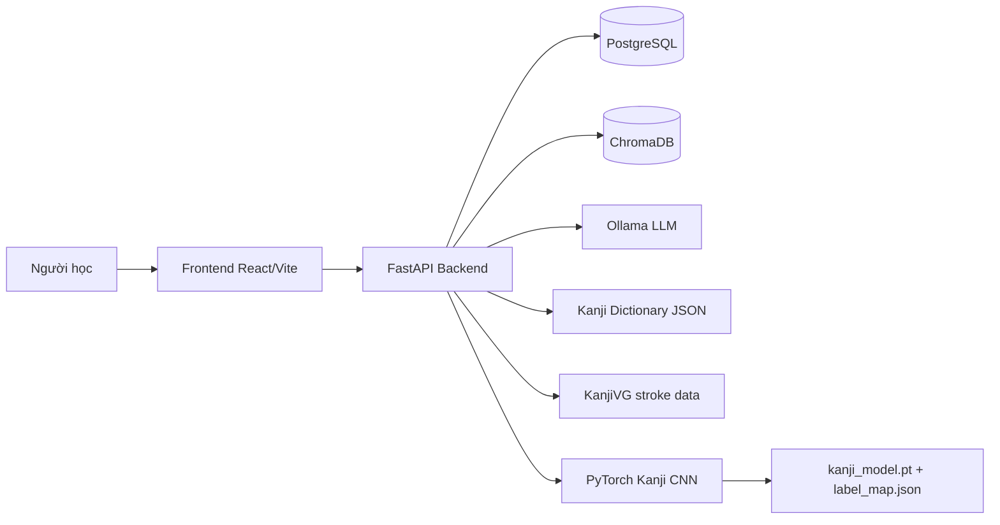
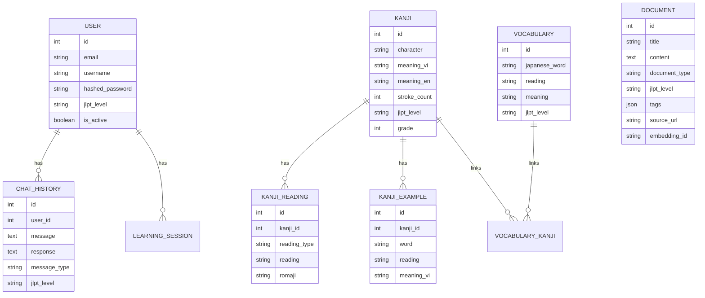
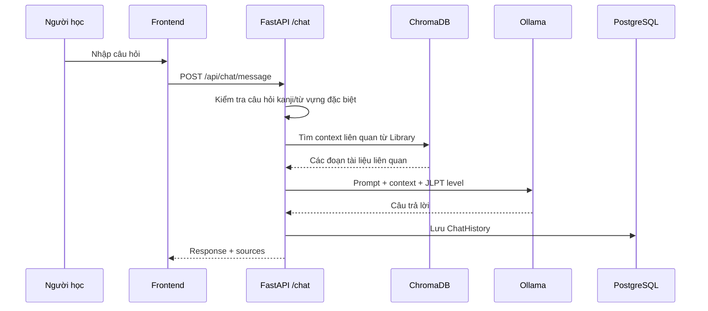
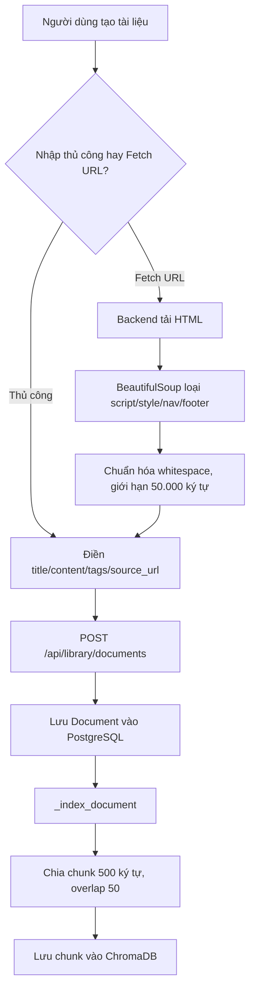
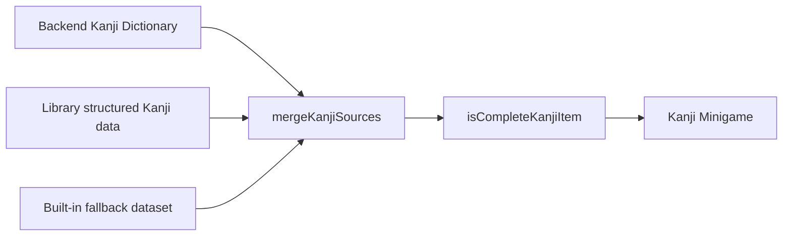
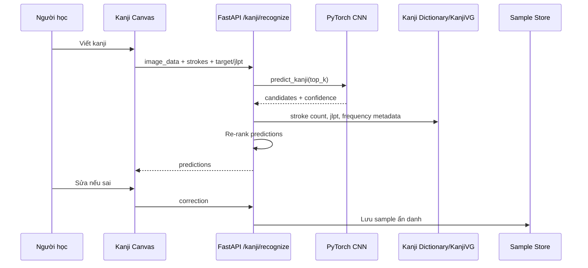

# Báo cáo dự án: Japanese Learning Assistant

## 1. Tổng quan dự án

Japanese Learning Assistant là ứng dụng web hỗ trợ học tiếng Nhật theo định hướng JLPT. Hệ thống kết hợp giao diện học tập bằng React, backend FastAPI, cơ sở dữ liệu PostgreSQL, tìm kiếm ngữ nghĩa bằng ChromaDB và mô hình ngôn ngữ chạy cục bộ qua Ollama.

Dự án tập trung vào các nhu cầu chính:

| Nhóm chức năng | Mục tiêu |
| --- | --- |
| Chat AI | Trả lời câu hỏi tiếng Nhật, giải thích ngữ pháp, từ vựng và kanji |
| Library | Lưu trữ tài liệu học, nhập nội dung thủ công hoặc từ URL, đánh chỉ mục vào vector database |
| Grammar | Phân tích ngữ pháp và dịch văn bản |
| Games | Học kanji, quiz đọc/nghĩa, tìm kiếm kanji và luyện ghép từ vựng |
| Kanji Canvas | Nhận dạng chữ kanji viết tay bằng CNN, luyện viết và xem dữ liệu nét |
| Hồ sơ học tập | Quản lý tài khoản, lịch sử chat và phiên học |

Tên trong README là `SenpaiAI`, trong metadata backend hiện có tên `HineGoldAI - Japanese Learning Assistant`. Về bản chất, đây là cùng một ứng dụng học tiếng Nhật.

## 2. Công nghệ sử dụng

### 2.1 Frontend

| Thành phần | Công nghệ |
| --- | --- |
| Framework | React 18, Vite |
| Ngôn ngữ | TypeScript và JSX |
| Routing | react-router-dom |
| API client | axios |
| State/server cache | react-query |
| Form/UI | react-hook-form, Tailwind CSS, lucide-react, framer-motion |
| Thông báo | react-hot-toast |
| Xử lý kana/romaji | romkan và helper nội bộ |

Frontend định nghĩa API base tại `frontend/src/services/api.ts`:

```ts
const API_BASE_URL = import.meta.env.VITE_API_BASE_URL || 'http://localhost:8000/api'
```

Nhờ đó các route frontend gọi thống nhất qua `/api`.

### 2.2 Backend

| Thành phần | Công nghệ |
| --- | --- |
| Web framework | FastAPI |
| ORM | SQLAlchemy |
| Validation | Pydantic v2 |
| Auth | JWT, passlib bcrypt |
| Database | PostgreSQL |
| Vector database | ChromaDB PersistentClient |
| LLM local | Ollama, mặc định `gemma:2b` |
| Text splitting | LangChain text splitters |
| HTML extraction | requests, BeautifulSoup |
| ML nhận dạng kanji | PyTorch CNN, Pillow, NumPy |

Backend có middleware CORS cho các origin phát triển phổ biến:

```text
http://localhost:3000
http://127.0.0.1:3000
http://localhost:5173
http://127.0.0.1:5173
```

### 2.3 Hạ tầng

`docker-compose.yml` cung cấp các service:

| Service | Vai trò |
| --- | --- |
| `ollama` | Chạy mô hình LLM và embedding model được kéo sẵn |
| `postgres` | Lưu dữ liệu người dùng, tài liệu, kanji, từ vựng |
| `backend` | API FastAPI |
| `frontend` | Giao diện web |
| `redis` | Service tùy chọn, hiện chưa thấy được dùng rõ trong luồng chính |

## 3. Kiến trúc tổng thể



Frontend chịu trách nhiệm hiển thị trải nghiệm học tập, quản lý trạng thái UI và gọi API. Backend xử lý xác thực, lưu trữ dữ liệu, truy vấn vector database, gọi LLM và nhận dạng kanji. Dữ liệu kanji dùng cho học tập được tách khỏi dữ liệu ảnh ETL10; ETL10 chỉ phục vụ huấn luyện nhận dạng chữ viết tay.

## 4. Mô hình dữ liệu

Các bảng chính được định nghĩa trong `backend/app/models/database.py`.



## 5. Backend API

### 5.1 Xác thực

Backend dùng JWT Bearer token. Các endpoint auth chính gồm:

| Endpoint | Chức năng |
| --- | --- |
| `/api/auth/register` | Đăng ký |
| `/api/auth/login` | Đăng nhập |
| `/api/auth/me` | Lấy/cập nhật thông tin người dùng |

Mật khẩu được hash bằng bcrypt. Token chứa email ở claim `sub`.

### 5.2 Chat và RAG

Luồng chat kết hợp dữ liệu Library và LLM:



Điểm đáng chú ý:

| Cơ chế | Mô tả |
| --- | --- |
| Trả lời kanji cục bộ | Nếu người dùng hỏi một kanji đơn lẻ, backend ưu tiên dictionary nội bộ thay vì gọi LLM |
| Vocabulary MCQ | Có service thử trả lời dạng câu hỏi trắc nghiệm từ vựng |
| RAG | Tìm context từ ChromaDB trước khi gọi LLM |
| Lịch sử | Lưu message, response, sources và metadata vào PostgreSQL |

### 5.3 Library

Library có các chức năng:

| Chức năng | API |
| --- | --- |
| Danh sách tài liệu | `GET /api/library/documents` |
| Tạo tài liệu | `POST /api/library/documents` |
| Cập nhật tài liệu | `PUT /api/library/documents/{id}` |
| Xóa tài liệu | `DELETE /api/library/documents/{id}` |
| Tìm kiếm | `POST /api/library/search` |
| Thống kê | `GET /api/library/stats` |
| Loại tài liệu/JLPT | `GET /api/library/categories` |
| Fetch từ URL | `POST /api/library/fetch-url` |
| Quiz vocabulary | `GET /api/library/quiz` |

Luồng nhập tài liệu và đánh chỉ mục:



Backend validate URL:

| Quy tắc | Giá trị |
| --- | --- |
| Protocol | Chỉ `http://` và `https://` |
| Timeout | 10 giây |
| Empty page | Bị từ chối |
| Giới hạn nội dung | 50.000 ký tự |

### 5.4 Kanji API

Các route kanji phục vụ cả Games và Kanji Canvas:

| API | Chức năng |
| --- | --- |
| `GET /api/kanji/list` | Danh sách kanji từ dictionary JSON |
| `GET /api/kanji/{kanji}` | Chi tiết một kanji |
| `GET /api/kanji/quiz` | Sinh câu hỏi quiz |
| `GET /api/kanji/matching-grid` | Dữ liệu ghép kanji-nghĩa |
| `GET /api/kanji/word-matching-grid` | Dữ liệu ghép từ vựng-nghĩa |
| `GET /api/kanji/dictionary-status` | Kiểm tra chất lượng dictionary |
| `POST /api/kanji/recognize` | Nhận dạng ảnh canvas |
| `POST /api/kanji/correction` | Lưu sửa lỗi từ người dùng |
| `GET /api/kanji/model-info` | Trạng thái model CNN |
| `GET /api/kanji/{kanji}/stroke-order` | Dữ liệu KanjiVG |
| `GET /api/kanji/{kanji}/handwriting-samples` | Mẫu ETL10 nếu có |

## 6. Frontend

### 6.1 Routing

`frontend/src/App.tsx` định nghĩa các màn hình chính:

| Route | Trang |
| --- | --- |
| `/chat` | Chat AI |
| `/grammar` | Phân tích ngữ pháp |
| `/library` | Thư viện tài liệu |
| `/games` | Game hub |
| `/games/kanji` | Kanji Minigame |
| `/kanji` | Kanji Canvas |
| `/quiz`, `/flashcard`, `/analytics`, `/profile` | Các module học tập khác |

### 6.2 API client

Frontend gom các nhóm API trong `frontend/src/services/api.ts`:

| Nhóm | Vai trò |
| --- | --- |
| `authAPI` | Đăng nhập, đăng ký, hồ sơ |
| `chatAPI` | Gửi tin nhắn, lịch sử chat |
| `analysisAPI` | Grammar, translation, JLPT prediction |
| `libraryAPI` | CRUD, search, stats, fetch URL |
| `kanjiRecognitionAPI` | Canvas recognition, correction, model info |
| `kanjiDataAPI` | Dictionary, quiz, KanjiVG, handwriting samples |

Axios interceptor tự thêm `Authorization: Bearer <token>` và chuyển về `/login` khi gặp HTTP 401.

## 7. Module Library

Library hiện là một module quản lý tài liệu học tập có giao diện:

| Thành phần UI | Chức năng |
| --- | --- |
| Stats cards | Tổng tài liệu, loại tài liệu, JLPT levels, vector chunks |
| Filter/search bar | Tìm theo query, type, JLPT, sort |
| Document grid | Hiển thị card tài liệu, tags, source URL |
| Detail modal | Xem nội dung đầy đủ, sửa/xóa |
| Add/Edit form | Nhập title, type, JLPT, tags, source URL, content |
| Fetch from URL | Tải trang web, trích nội dung, đổ vào form |

Khi lưu tài liệu, backend gọi `_index_document` để đưa nội dung vào ChromaDB. Vì vậy tài liệu mới có thể được dùng làm ngữ cảnh cho Chat/RAG.

## 8. Module Kanji Minigame

Kanji Minigame được đặt tại `frontend/src/pages/KanjiMinigame.jsx`. Module này hiện đã được tổ chức lại thành 4 mode:

| Mode | Mô tả |
| --- | --- |
| Kanji Study | Học từng kanji qua nghĩa, readings, ví dụ, thông tin nhanh |
| Kanji Quiz | Quiz đọc, quiz nghĩa và nhập reading |
| Kanji Search | Tìm kanji theo ký tự, nghĩa, onyomi, kunyomi, romaji, ví dụ |
| Vocabulary Grid | Game ghép cặp từ/nghĩa/reading/kanji/câu |

### 8.1 Nguồn dữ liệu

Thứ tự ưu tiên dữ liệu trong Games:



Các helper quan trọng trong `frontend/src/data/kanjiDataset.ts`:

| Hàm | Vai trò |
| --- | --- |
| `normalizeKanjiItem` | Chuẩn hóa dữ liệu từ backend/library/fallback |
| `mergeKanjiSources` | Gộp nhiều nguồn theo ký tự kanji |
| `isCompleteKanjiItem` | Lọc bỏ card thiếu nghĩa, reading, romaji, stroke count hoặc examples |
| `searchKanjiDataset` | Tìm kiếm đa trường |
| `checkKanjiReadingAnswer` | Kiểm tra câu trả lời đọc kanji |
| `toHiragana` | Chuẩn hóa katakana về hiragana |
| `kanaToBasicRomaji` | Tạo romaji cơ bản từ kana |

### 8.2 Kanji Study

Kanji Study dùng layout dạng dashboard compact:

| Khu vực | Nội dung |
| --- | --- |
| Card chính | Kanji lớn, JLPT badge, tiến độ `Kanji x / total`, nghĩa tiếng Việt/Anh |
| Quick info | Radical, stroke count, JLPT, frequency |
| Navigation | Previous, Random, Next |
| Onyomi/Kunyomi | Reading chip nhỏ, romaji và nút audio |
| Sidebar examples | Tối đa 3 ví dụ ban đầu, có View More |
| Quick Quiz | Nút mở Reading Quiz hoặc Meaning Quiz |
| Progress | Phần trăm learned, số learned/total |

Stroke Order đã được loại khỏi Minigame để tránh trùng vai trò với Kanji Canvas.

### 8.3 Kanji Quiz

Kanji Quiz gộp các quiz đọc và on/kun reading vào cùng một mode:

| Quiz | Cách hoạt động |
| --- | --- |
| Reading Quiz | Chọn cách đọc đúng, distractor lấy từ các kanji khác |
| Meaning Quiz | Chọn nghĩa đúng |
| Typed Reading | Nhập hiragana, katakana hoặc romaji |

Hàm kiểm tra reading chấp nhận:

| Input | Ví dụ | Kết quả |
| --- | --- | --- |
| Hiragana | `にち` | So với onyomi/kunyomi sau khi chuẩn hóa |
| Katakana | `ニチ` | Chuyển về hiragana rồi so sánh |
| Romaji | `nichi` | So với romaji có sẵn hoặc sinh từ kana |
| Full-width/half-width | Chuẩn hóa bằng `NFKC` |
| Khoảng trắng | Bị loại bỏ |

### 8.4 Vocabulary Grid

Vocabulary Grid hỗ trợ nhiều kiểu ghép:

| Mode | Cặp ghép |
| --- | --- |
| Word - Meaning | `学生` ↔ `học sinh` |
| Word - Reading | `学生` ↔ `がくせい` |
| Reading - Meaning | `がくせい` ↔ `học sinh` |
| Kanji - Meaning | `日` ↔ `ngày` |
| Kanji - Reading | `日` ↔ `にち` |
| Sentence - Translation | Câu ↔ bản dịch |

UI hiển thị Correct, Wrong, Accuracy và Streak.

### 8.5 Audio pronunciation

Frontend dùng Web Speech API:

```js
const utterance = new SpeechSynthesisUtterance(text)
utterance.lang = 'ja-JP'
utterance.rate = 0.9
window.speechSynthesis.speak(utterance)
```

Audio được dùng cho onyomi, kunyomi, ví dụ và kanji.

## 9. Module Kanji Canvas và ML

Kanji Canvas nằm tại route `/kanji`. Module này phục vụ nhận dạng và luyện viết, khác với Kanji Minigame.

### 9.1 Luồng nhận dạng



### 9.2 Dữ liệu ML

Theo README của `backend/ml`, pipeline hiện hỗ trợ:

| Thành phần | Vai trò |
| --- | --- |
| Synthetic Kanji | Sinh ảnh chữ từ font hệ thống để huấn luyện |
| ETL10 | Dữ liệu ảnh viết tay tùy chọn, chỉ dùng cho recognition training |
| User corrections | Mẫu sửa sai để fine-tune sau |
| KanjiVG | Dữ liệu nét để overlay, stroke count, tham chiếu luyện viết |
| CNN | Model `kanji-cnn-v1` dự đoán top-k kanji |

Ollama không được dùng để nhận dạng hình ảnh. Ollama chỉ nên dùng để giải thích kanji, ví dụ và phản hồi học tập.

Model artifact cần có:

```text
backend/ml/models/kanji_model.pt
backend/ml/models/label_map.json
```

Nếu thiếu model, endpoint recognition trả về trạng thái unavailable thay vì bịa kết quả.

## 10. Module LLM và Ollama

`JapaneseLearningService` chọn provider theo cấu hình:

| Provider | Cách dùng |
| --- | --- |
| Ollama | Mặc định, gọi `ollama.chat` hoặc fallback `ollama.generate` |
| OpenAI | Fallback nếu cấu hình provider là OpenAI |

Mặc định Docker Compose kéo:

```text
gemma:2b
nomic-embed-text
```

Lưu ý triển khai hiện tại: ChromaDB service dùng default embedding function của Chroma, chưa thấy gọi trực tiếp Ollama embedding model trong `vector_db.py`. Vì vậy `nomic-embed-text` được chuẩn bị trong compose nhưng chưa chắc đã là embedding function thực tế của Chroma.

## 11. Use case chính

### 11.1 Người học hỏi Chat AI

1. Người học đăng nhập.
2. Vào Chat.
3. Nhập câu hỏi, ví dụ: “Giải thích は và が”.
4. Backend tìm context trong Library.
5. Backend gọi Ollama với prompt tiếng Nhật/JLPT.
6. Câu trả lời được trả về và lưu lịch sử.

### 11.2 Người học thêm tài liệu từ URL

1. Vào Library.
2. Bấm Add New Document.
3. Nhập Source URL.
4. Bấm Fetch from URL.
5. Backend tải HTML, lọc nội dung chính.
6. Frontend tự điền title/content.
7. Người học kiểm tra và Save.
8. Document được lưu vào PostgreSQL và index vào ChromaDB.

### 11.3 Người học luyện Kanji Minigame

1. Vào Games/Kanji.
2. Chọn JLPT N5/N4 hoặc All.
3. Dùng Kanji Study để xem nghĩa, reading và ví dụ.
4. Dùng Previous/Random/Next để chuyển card.
5. Bấm audio để nghe phát âm.
6. Chuyển sang Kanji Quiz để làm reading/meaning/typed quiz.
7. Dùng Kanji Search để tra nhanh.
8. Dùng Vocabulary Grid để luyện ghép cặp.

### 11.4 Người học dùng Kanji Canvas

1. Vào Kanji Canvas.
2. Viết kanji trên canvas.
3. Bấm recognize.
4. Backend chạy CNN và re-rank kết quả.
5. Người học xem dự đoán, mini dictionary, ví dụ.
6. Nếu sai, gửi correction để lưu mẫu huấn luyện.

## 12. Hướng dẫn chạy dự án

### 12.1 Chạy bằng Docker Compose

```powershell
docker-compose up --build
```

Các địa chỉ thường dùng:

| Dịch vụ | URL |
| --- | --- |
| Frontend | `http://localhost:3000` |
| Backend | `http://localhost:8000` |
| API docs | `http://localhost:8000/docs` |
| Ollama | `http://localhost:11434` |

### 12.2 Chạy backend thủ công

```powershell
cd backend
python -m venv venv
.\venv\Scripts\python.exe -m pip install -r requirements.txt
.\venv\Scripts\python.exe -m uvicorn app.main:app --reload --host 0.0.0.0 --port 8000
```

### 12.3 Chạy frontend thủ công

```powershell
cd frontend
npm install
npm run dev
```

Có thể cấu hình:

```env
VITE_API_BASE_URL=http://localhost:8000/api
```

## 13. Kiểm thử và đánh giá

Các nhóm kiểm thử nên thực hiện:

| Nhóm | Nội dung |
| --- | --- |
| Backend health | `GET /health` |
| Auth | Register, login, token invalid/expired |
| Library | CRUD, fetch-url, search, stats, delete vector chunks |
| RAG | Tạo tài liệu rồi hỏi Chat để kiểm tra source/context |
| Kanji dictionary | `/api/kanji/dictionary-status`, list/search/detail |
| Kanji Minigame | Fallback data, JLPT filter, search, quiz typed reading |
| Kanji Canvas | Model unavailable path, model loaded path, correction |
| Frontend build | `npm run build` |

Một số điểm cần chú ý khi kiểm thử:

| Vấn đề | Ghi chú |
| --- | --- |
| Encoding | Một số file/dữ liệu khi xem qua terminal có hiện tượng mojibake, cần mở bằng UTF-8 và kiểm tra lại hiển thị thật trong browser |
| Backend test env | Cần cài đúng dependency trong venv, bao gồm pydantic, pytest nếu có test suite |
| Model CNN | Nếu thiếu `kanji_model.pt` hoặc `label_map.json`, recognition sẽ báo unavailable |
| Ollama | Cần đảm bảo model đã được pull và service reachable |

## 14. Ưu điểm

| Ưu điểm | Mô tả |
| --- | --- |
| Kiến trúc rõ | Frontend, backend, database, vector DB và LLM tách riêng |
| Ưu tiên local AI | Ollama giúp chạy LLM cục bộ, giảm phụ thuộc API bên ngoài |
| RAG thực tế | Library được index để Chat trả lời theo tài liệu người học |
| Kanji học và viết tách vai trò | Minigame tập trung học nghĩa/reading, Canvas tập trung handwriting |
| Có fallback data | Games vẫn có nội dung khi backend/library rỗng |
| Có kiểm soát dữ liệu | Kanji card thiếu metadata bị lọc, tránh card hỏng |
| URL import hữu ích | Người dùng có thể nhanh chóng nhập bài học từ website |

## 15. Hạn chế hiện tại

| Hạn chế | Tác động |
| --- | --- |
| Dữ liệu kanji còn có dấu hiệu encoding lỗi | Có thể hiển thị sai ký tự Nhật/Vietnamese nếu file nguồn không chuẩn UTF-8 |
| Dictionary backend chủ yếu N5/N4 | Các level N3/N2/N1 chưa đầy đủ |
| Chroma embedding chưa dùng trực tiếp Ollama embedding | Chất lượng retrieval phụ thuộc embedding mặc định của Chroma |
| Recognition phụ thuộc model artifact | Thiếu file model thì Canvas không nhận dạng được |
| Fetch URL dùng heuristic | Một số trang web nhiều JavaScript hoặc anti-bot có thể không trích xuất tốt |
| Redis chưa rõ vai trò | Có service trong compose nhưng chưa thấy luồng chính sử dụng |
| Grammar/translation phụ thuộc LLM | Chất lượng câu trả lời thay đổi theo model Ollama |

## 16. Hướng phát triển

| Hướng | Chi tiết |
| --- | --- |
| Chuẩn hóa dữ liệu kanji | Import KANJIDIC2 cho nghĩa, onyomi, kunyomi, JLPT, stroke count |
| Chuẩn hóa từ vựng | Import JMdict/JMnedict cho vocabulary, readings, ví dụ |
| Mở rộng JLPT | Bổ sung N3/N2/N1, lọc theo frequency/difficulty |
| Embedding Ollama | Dùng `nomic-embed-text` trực tiếp cho Chroma để nhất quán local AI |
| Spaced repetition | Thêm SRS kiểu Anki/WaniKani cho Kanji Study và Quiz |
| Analytics học tập | Lưu kết quả quiz, streak, accuracy, thời gian học |
| Cải thiện Fetch URL | Tích hợp readability-lxml/trafilatura nếu khả dụng |
| Huấn luyện recognition | Bổ sung ETL10, synthetic augmentation và user corrections |
| Test tự động | Thêm pytest backend và component/e2e tests frontend |

## 17. Kết luận

Japanese Learning Assistant là một hệ thống học tiếng Nhật tương đối đầy đủ, có cả AI chat, thư viện tài liệu, RAG, kanji minigame và nhận dạng chữ viết tay. Kiến trúc hiện tại phù hợp để mở rộng theo hướng sản phẩm học JLPT cá nhân hóa.

Phần mạnh nhất của dự án là sự kết hợp giữa dữ liệu học tập có cấu trúc, tài liệu người dùng tự nhập, LLM local và các game luyện tập. Các điểm cần ưu tiên tiếp theo là chuẩn hóa encoding/dataset, mở rộng dictionary chuẩn, dùng embedding local nhất quán và bổ sung kiểm thử tự động để ổn định hệ thống.
